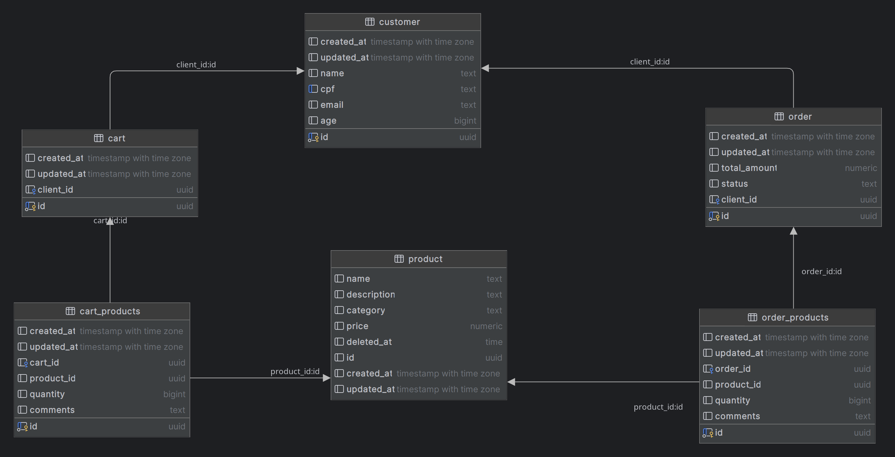

# Tech Challenge DB

This repository groups the DB configurations required for the microservice https://github.com/pangolin-do-golang/tech-challenge .

## Table Structure

## Why we choose a relational database? 

PostgreSQL is an exceptionally robust, open-source relational database system that makes it an excellent choice for a restaurant process management system. Here's a breakdown of why:

* Rich Data Types: PostgreSQL supports a wide range of data types beyond the standard numeric, character, and date/time types. This includes arrays, JSON, and geographic data. For a restaurant, you could store complex data like menus, customer preferences, and even map locations of multiple branches using these data types.
* Scalability: PostgreSQL can handle large datasets and heavy workloads, making it suitable for businesses of all sizes. As your restaurant grows and your data volume increases, PostgreSQL can scale accordingly.
* Reliability: PostgreSQL is known for its reliability and data integrity. Features like ACID compliance ensure that your data is consistent and transactions are processed correctly.
* Cost-Effective: As an open-source database, PostgreSQL itself is free to use. When deployed in the cloud, the cost is primarily associated with the underlying infrastructure (compute, storage, network), which is generally very affordable, especially for small to medium-sized businesses.

## Applying in the restaurant context

Relational databases, like PostgreSQL, are ideal for managing structured data. In a restaurant management system, you'll deal with structured data such as:

* Customer
* Order
* Product

Relational databases excel at handling these kinds of relationships. For instance, you can easily query a database to find all orders placed by a specific customer, or determine the most popular order item.

## Applying on cloud

Cloud providers like AWS, GCP, and Azure offer managed PostgreSQL services, making it easy to set up and manage a database instance. These services often have pay-as-you-go pricing models, meaning you only pay for the resources you use. For small to medium-sized restaurants, the cost of running a PostgreSQL instance in the cloud is typically very low, especially when compared to the costs of on-premises hardware and maintenance.

In summary, PostgreSQL is a powerful, flexible, and affordable choice for a restaurant management system. Its ability to handle structured data, scale as needed, and integrate with other systems makes it a compelling option for businesses looking to streamline their operations.
